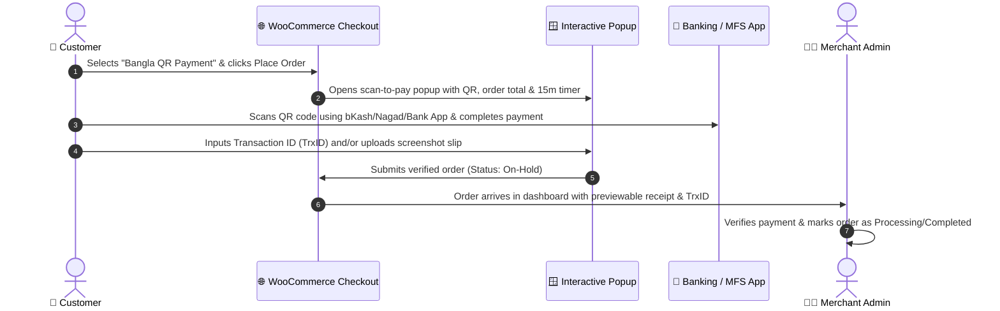

<a name="top"></a>
<h1 align="center">
  <br>
  BanglaQR Gateway by Oi
</h1>

<p align="center">
  
</p>

<p align="center">
  <strong>The Ultimate BanglaQR, MFS & Bank QR Gateway</strong><br>
  <em>Accept bKash, Nagad, Rocket, Upay, CellFin & Bank QR payments seamlessly with an interactive popup, live timer, and receipt verification.</em>
</p>

<p align="center">
  <a href="https://wordpress.org/"></a>
  <a href="https://woocommerce.com/"></a>
  <a href="https://www.php.net/"></a>
  <a href="LICENSE"></a>
  <a href="#"></a>
</p>

<p align="center">
  <a href="https://github.com/Oi-Technologies-Official/BanglaQR-Payment-Gateway-by-Oi/releases"></a>
  <a href="https://github.com/Oi-Technologies-Official/BanglaQR-Payment-Gateway-by-Oi/stargazers"></a>
  <a href="https://github.com/Oi-Technologies-Official/BanglaQR-Payment-Gateway-by-Oi/network/members"></a>
  <a href="https://github.com/Oi-Technologies-Official/BanglaQR-Payment-Gateway-by-Oi/issues"></a>
  <a href="https://github.com/Oi-Technologies-Official/BanglaQR-Payment-Gateway-by-Oi/commits/main"></a>
</p>

<p align="center">
  <a href="#-why-banglaqr-gateway">Why BanglaQR?</a> •
  <a href="#-key-features">Features</a> •
  <a href="#-how-it-works">How It Works</a> •
  <a href="#-supported-apps--banks">Supported Apps</a> •
  <a href="#%EF%B8%8F-installation--setup">Installation</a> •
  <a href="#%EF%B8%8F-admin-configuration-guide">Configuration</a> •
  <a href="#%EF%B8%8F-screenshots">Screenshots</a> •
  <a href="#-developer-hooks--meta">Developers</a> •
  <a href="#-security--data-integrity">Security</a> •
  <a href="#-frequently-asked-questions">FAQ</a> •
  <a href="#-contributing">Contributing</a> •
  <a href="#-about-oi">About Oi</a>
</p>

<div align="center">

⭐ **If this plugin saves you money on gateway fees, please consider starring the repo — it genuinely helps other Bangladeshi merchants discover it.**

</div>

---

## 📖 Why BanglaQR Gateway?

Taking digital payments in Bangladesh often involves expensive setup charges, complicated contracts, merchant account approval delays, and high gateway commissions.

**BanglaQR Gateway by Oi** brings the national interoperable **BanglaQR** framework (introduced by Bangladesh Bank) directly to your WooCommerce store. It bridges the gap between merchant simplicity and customer convenience:

| | |
|---|---|
| 💸 | **Zero Gateway Fees** — No expensive monthly gateway subscriptions or third-party merchant contracts required. |
| 📱 | **Universal Compatibility** — Works with any bank app or Mobile Financial Service (MFS) in Bangladesh. |
| ⚡ | **Seamless Checkout Experience** — Customers scan, pay, and attach proof without navigating away to confusing third-party gateways. |
| 🛡️ | **Total Control** — Review customer receipts and Transaction IDs directly inside the WooCommerce order dashboard before fulfilling orders. |

<div align="right"><a href="#top">↑ back to top</a></div>

---

## 🔄 How It Works



<div align="right"><a href="#top">↑ back to top</a></div>

---

## ✨ Key Features

| Feature | Description |
|---|---|
| 🇧🇩 **Unified BanglaQR Standard** | Fully compatible with Bangladesh Bank's interoperable QR system — one QR code works across all participating banks and MFS providers. |
| 🪟 **Interactive Scan-to-Pay Modal** | Clean popup modal that displays the active QR code, calculated payable total, and a live 15-minute countdown. |
| ⏱️ **1-Click Session Renewal** | If the 15-minute timer expires, customers can extend it with a single click without losing checkout input or reloading. |
| 💰 **Dynamic Percentage Fees** | Set optional gateway processing or cash-out charges (e.g. 1.85% for bKash, 0% for bank transfers) automatically added to checkout. |
| 📸 **Instant Slip & Receipt Upload** | Customers can drag-and-drop or select payment screenshots directly inside the checkout popup. |
| 🗜️ **Client & Server Image Compression** | High-resolution mobile screenshots are automatically resized (max 1200px) and compressed to save hosting storage and bandwidth. |
| 📋 **Manual Mobile Banking Fallback** | Option to show direct personal or merchant numbers (bKash, Nagad, Rocket, Upay, CellFin) with one-click copy buttons. |
| ⚙️ **Customizable Validation Rules** | Configure Transaction ID and Receipt Screenshot fields as **Mandatory**, **Optional**, or **Hidden**. |
| 🔠 **Smart TrxID Formatting** | Automatically normalizes and formats Transaction IDs to clean uppercase alphanumeric characters to eliminate customer typos. |
| 🎨 **Theme Color Customizer** | Choose an accent color that perfectly matches your store's branding and theme typography. |
| 🔄 **Drag-and-Drop QR Manager** | Add multiple QR accounts, prioritize the active QR code, and reorder accounts with an intuitive admin interface. |
| 🚀 **Full HPOS Compatibility** | Fully tested and compatible with WooCommerce High-Performance Order Storage (HPOS) and legacy post-based storage. |
| 🧹 **Automated Storage Cleanup** | Built-in daily WP-Cron purges unattached temporary receipts older than 24 hours to prevent server disk bloat. |

<div align="right"><a href="#top">↑ back to top</a></div>

---

## 📱 Supported Apps & Banks

Customers can pay using any app compatible with BanglaQR or direct MFS transfer:

<table>
<tr>
<th>💠 Mobile Financial Services (MFS)</th>
<th>🏦 Banks & Digital Wallets</th>
</tr>
<tr>
<td valign="top">

- **bKash** (App & Send Money / Merchant)
- **Nagad** (App & Send Money / Merchant)
- **Rocket** (Dutch-Bangla Bank)
- **Upay** (UCB)
- **Tap** / Trust Axiata Pay
- **MCash**, **SureCash**, **OK Wallet**

</td>
<td valign="top">

- **CellFin** (Islami Bank Bangladesh)
- **Citytouch** (City Bank)
- **Astha** (BRAC Bank)
- **MTB Smart Banking** (Mutual Trust Bank)
- **EBL Skybanking** (Eastern Bank)
- **Any other bank app supporting BanglaQR**

</td>
</tr>
</table>

<div align="right"><a href="#top">↑ back to top</a></div>

---

## ⚙️ Installation & Setup

### Requirements

| Requirement | Version |
|---|---|
| **WordPress** | 5.6 or higher (Tested up to 6.7) |
| **WooCommerce** | 5.0 or higher |
| **PHP** | 7.4 to 8.3+ |
| **PHP Extensions** | `gd` or `imagick` (for image compression and slip processing) |

### Quick Setup

1. **Download & Upload**
   - Download the plugin `.zip` from the [Releases](https://github.com/Oi-Technologies-Official/BanglaQR-Payment-Gateway-by-Oi/releases) section.
   - In your WordPress Admin, navigate to **Plugins → Add New → Upload Plugin**.
   - Select the `.zip` file and click **Install Now**.
2. **Activate**
   - Click **Activate Plugin** once the installation is complete.
3. **Configure Settings**
   - Go to **WooCommerce → Settings → Payments**.
   - Click **Manage** next to **Bangla QR Payment**.
   - Enable the gateway, upload your QR code, and save! 🎉

<div align="right"><a href="#top">↑ back to top</a></div>

---

## 🛠️ Admin Configuration Guide

Navigate to **WooCommerce → Settings → Payments → Bangla QR Payment** to configure the following options.

<details open>
<summary><strong>1. General Gateway Settings</strong></summary>
<br>

- **Enable/Disable:** Turn the BanglaQR gateway on or off.
- **Payment Title:** The title displayed to customers on the checkout page (Default: `Bangla QR Payment`).
- **Gateway Logo:** Provide a custom logo image URL or use the built-in default logo.
- **Payment Description:** Instructions shown when the customer selects this payment option.
- **Theme Accent Color:** Pick a custom HEX color for modal buttons, highlights, and borders.
- **Default Order Status:** Choose the initial status for newly placed orders (`On-Hold`, `Processing`, `Completed`, or `Pending Payment`).

</details>

<details>
<summary><strong>2. QR Accounts Manager</strong></summary>
<br>

- **Add / Remove Accounts:** Add multiple QR codes for different banks or MFS providers.
- **Active Account:** Select which QR code will be presented to customers on checkout.
- **Payment Charge (%):** Specify a fee percentage (e.g., `1.85` for bKash cashout fee, `0` for no charge).
- **Drag-and-Drop:** Easily reorder QR accounts in the admin interface.

</details>

<details>
<summary><strong>3. Receipt & Transaction ID Rules</strong></summary>
<br>

**Receipt Screenshot Rule**
- `Mandatory` — Customer must upload a screenshot before the order is placed.
- `Optional` — Customer can upload a screenshot or skip.
- `Hidden` — Upload field is completely hidden.

**Transaction ID Rule**
- `Mandatory` — Customer must enter a TrxID.
- `Optional` — TrxID is optional.
- `Hidden` — TrxID input field is hidden.

</details>

<details>
<summary><strong>4. Manual Mobile Banking Numbers</strong></summary>
<br>

- **Enable Manual Payment:** Check to display manual account numbers below the QR code.
- **Account Numbers:** Enter your numbers for **bKash**, **Nagad**, **Rocket**, **Upay**, and **CellFin**. Customers get a convenient one-click copy button for each number.

</details>

<div align="right"><a href="#top">↑ back to top</a></div>

---

## 🖼️ Screenshots

<table>
<tr>
<td width="50%" align="center">
<br>
<strong>1. QR Accounts Manager</strong><br>
<sub>Add, sort, and activate multiple payment QR codes.</sub>
</td>
<td width="50%" align="center">
<br>
<strong>2. Gateway Settings</strong><br>
<sub>Set fees, custom titles, manual numbers, and upload rules.</sub>
</td>
</tr>
<tr>
<td width="50%" align="center">
<br>
<strong>3. Checkout Popup</strong><br>
<sub>Responsive scan-to-pay modal with QR, timer, and slip upload.</sub>
</td>
<td width="50%" align="center">
<br>
<strong>4. Checkout Selection</strong><br>
<sub>Seamlessly integrates with the default WooCommerce checkout.</sub>
</td>
</tr>
<tr>
<td width="50%" align="center">
<br>
<strong>5. Admin Order Details</strong><br>
<sub>Review customer Transaction ID and inspect the full payment receipt.</sub>
</td>
<td width="50%"></td>
</tr>
</table>

<div align="right"><a href="#top">↑ back to top</a></div>

---

## 👨‍💻 Developer Hooks & Meta

For developers looking to customize or integrate the plugin with custom themes and ERPs:

### Filters

```php
// Make the payment processing fee taxable or non-taxable (default: false)
add_filter('oi_banglaqr_fee_is_taxable', function($is_taxable) {
    return true; // Set to true if fees should include store taxes
});

// Customize the gateway icon HTML
add_filter('woocommerce_gateway_icon', function($icon, $gateway_id) {
    if ($gateway_id === 'oi_banglaqr') {
        // Custom icon logic
    }
    return $icon;
}, 10, 2);
```

### Order Metadata Keys

When an order is created via BanglaQR, the following metadata is saved to the `WC_Order`:

| Meta Key | Description |
|---|---|
| `_oi_banglaqr_selected_qr` | The name of the QR account selected for the payment. |
| `_oi_banglaqr_transaction_id` | The transaction ID entered by the customer. |
| `_oi_banglaqr_receipt_id` | The WordPress media attachment ID (or URL) of the uploaded receipt. |

```php
$order = wc_get_order($order_id);
$trx_id     = $order->get_meta('_oi_banglaqr_transaction_id');
$receipt_id = $order->get_meta('_oi_banglaqr_receipt_id');
$qr_name    = $order->get_meta('_oi_banglaqr_selected_qr');
```

<div align="right"><a href="#top">↑ back to top</a></div>

---

## 🔐 Security & Data Integrity

We prioritize the security of both merchants and customers:

- 🛡️ **Session-Locked Uploads** — Uploaded payment slips are strictly bound to the customer's active WooCommerce session token, preventing Insecure Direct Object Reference (IDOR) exploits.
- 🛡️ **Strict File MIME Verification** — Server-side validation inspects real file headers and MIME types (`image/jpeg`, `image/png`, `image/webp`). Executable scripts or forged extensions are immediately blocked.
- 🛡️ **Automated Orphan File Pruning** — A scheduled daily WP-Cron cleans up unassociated temporary uploads older than 24 hours, preventing storage abuse.
- 🛡️ **Input Sanitization & Escaping** — All Transaction IDs, field values, and user inputs are strictly sanitized and escaped against SQL injection and XSS.
- 🛡️ **HPOS & WooCommerce Standards** — Compliant with WooCommerce High-Performance Order Storage (HPOS) and official WordPress Plugin Coding Guidelines.

For responsible vulnerability disclosure procedures, please refer to our **[Security Policy (SECURITY.md)](SECURITY.md)**.

<div align="right"><a href="#top">↑ back to top</a></div>

---

## ❓ Frequently Asked Questions

<details>
<summary><strong>🔹 Do I need an official BanglaQR merchant account to use this plugin?</strong></summary>
<br>
No, an official merchant account is not required! You can upload an official bank merchant BanglaQR (City Bank, BRAC Bank, MTB, EBL, etc.), or use personal/agent QR codes from bKash, Nagad, Rocket, or CellFin. You can also provide manual phone numbers.
</details>

<details>
<summary><strong>🔹 Can I add payment processing or cash-out charges to the customer's total?</strong></summary>
<br>
Yes! You can specify a percentage fee (e.g. 1.85% for bKash, or 0% for bank transfers) for each QR account. When the customer selects that QR, the fee is automatically calculated and added to the order total.
</details>

<details>
<summary><strong>🔹 Where do I view the customer's payment slip and Transaction ID?</strong></summary>
<br>
When an order is placed, open the order in <strong>WooCommerce → Orders</strong>. A dedicated BanglaQR receipt card will show the customer's Transaction ID and a preview of their uploaded payment screenshot, with a one-click link to view the full resolution image.
</details>

<details>
<summary><strong>🔹 What happens if the customer's 15-minute session timer expires?</strong></summary>
<br>
The modal will display a friendly message with a <strong>"Renew Session (15m)"</strong> button. The customer can reset the timer with one click without losing entered information or reloading the page.
</details>

<details>
<summary><strong>🔹 Does this work for guest checkouts?</strong></summary>
<br>
Yes. Guest checkouts are fully supported through secure, temporary session tokens linked directly to the guest's checkout session.
</details>

<details>
<summary><strong>🔹 Is this plugin compatible with WooCommerce High-Performance Order Storage (HPOS)?</strong></summary>
<br>
Yes, the plugin is 100% compatible with HPOS and works flawlessly on both modern HPOS tables and classic post-meta order storage.
</details>

<div align="right"><a href="#top">↑ back to top</a></div>

---

## 🤝 Contributing

Contributions are warmly welcomed! We encourage developers and merchants to help improve **BanglaQR Gateway by Oi**.

Please review our **[Contributing Guidelines (Contributing.md)](Contributing.md)** and **[Code of Conduct (Code of Conduct.md)](Code%20of%20Conduct.md)** before submitting code or opening pull requests.

### Quick Contribution Steps

1. **Fork** this repository.
2. **Create a branch** for your feature or fix:
   ```bash
   git checkout -b feature/amazing-feature
   ```
3. **Commit your changes**:
   ```bash
   git commit -m "feat: add support for custom modal header"
   ```
4. **Push to your fork**:
   ```bash
   git push origin feature/amazing-feature
   ```
5. **Open a Pull Request** describing your changes.

<p align="center">
  <a href="https://github.com/Oi-Technologies-Official/BanglaQR-Payment-Gateway-by-Oi/graphs/contributors">
    
  </a>
</p>

<div align="right"><a href="#top">↑ back to top</a></div>

---

## 📄 License

This project is licensed under the **GNU General Public License v3.0 or later (GPLv3)** — see the [LICENSE](LICENSE) file for details.

---

## 🏢 About Oi

**Oi** builds high quality, accessible open-source tools that empower merchants, developers, and digital businesses across Bangladesh.

<p align="center">
  <a href="https://oitech.com.bd"></a>
  <a href="mailto:support@oitech.com.bd"></a>
  <a href="https://oitech.com.bd/open-source/"></a>
  <a href="https://oitech.com.bd/helpline/contact-us/"></a>
</p>

---

<p align="center">
  <strong>Crafted with ❤️ for the Bangladeshi eCommerce Community 🇧🇩</strong><br>
  <em>Simplifying digital payments, one store at a time.</em>
</p>

<div align="center">

[⬆ Back to Top](#top)

</div>